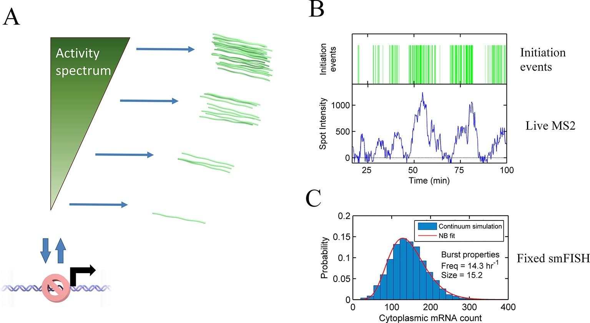

# 一级标题  article

## 二级标题  Main plot
1. 正文（同一段内两个空格）  
  换行

2. 新启一段

3. **加粗字体**(markdown all in one--->快捷键：ctrl+**b**)
4. *边斜字体*(markdown all in one--->快捷键：ctrl+**i**)  
5. 有序列表（数字+回车）
    1. 一（数字后要有空格）
    2. 二
       1. 第1.1
       2. 第1.2
          1. 第1.1.1 
    3. 三

6. 插入图片，paste image插件
   网页复制链接
   ctrl+alt+v复制  
   
   *科研绘图*

7. 插入公式  
   latex公式(两个美元符号$$ $$)
   快捷键(ctrl+m连按两下)
   $$
   \lim_{x \to \infin}\frac{sin(t)}{x}=1
   $$
   在一段文字中插入公式：快捷键(ctrl+m)    $\lim_{x \to \infin}\frac{sin(t)}{x}=1$
8. 表格  
   | 班级  |    学号    | 姓名 |
   | ----- | :--------: | ---- |
   | 12204 | 2226010406 | lsx  |
   
   左右加上冒号表示居中  
   不加默认左对齐  
   调整文本表格格式，格式化---->alt+shift+f 键

9. 链接  
    这是一个[链接](https://chatbot.theb.ai/#/chat/1002)：
    两种方式  
    1.选中链接，然后CTRL+V  
    2.直接CTRL+V  
    markdown插件会自动识别的  
    本文格式为第二种

10. 代码块  
    可以自动高亮  
    ```python
    import numpy as np  
    arr = np.array([[0.2,0.9],[0.3,0.5],[0.2,0.4]])
    print(arr+2)
    ```  
    可以自动以你选择的语言高亮输出：```右上角

### 三级标题  省略

